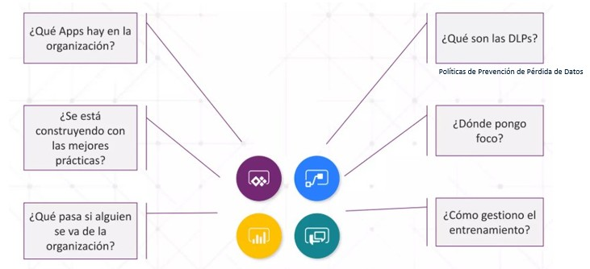
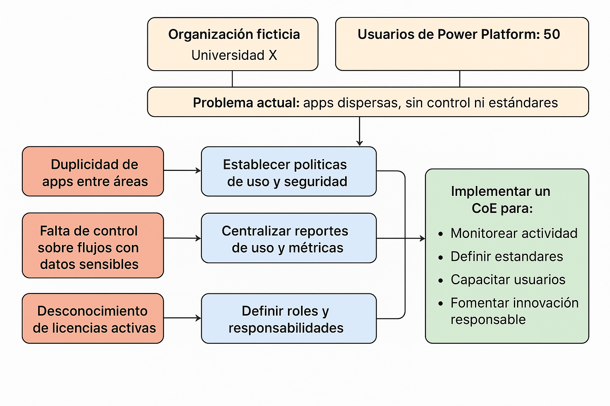

# Identificar casos de uso de gobernanza en Power Platform

## Objetivo de la práctica:
Al finalizar la práctica, serás capaz de:
- Identificar y representar casos de uso de gobernanza en Power Platform, mostrando por qué sería necesario implementar un CoE.

## Objetivo Visual 
Actividades a analizar

## Duración aproximada:
- 60 minutos.

## Tabla de ayuda:
Durante el laboratorio el participante puede trabajar con cualquier herramientas que le permita generar el gráfico. Sin embargo se sugiere la siguiente: https://app.diagrams.net

-Al ingresar elige "Decide later" cuando te pregunte por almacenamiento (así no necesitas registro).

-En el lienzo en blanco usa rectángulos o cuadros de texto para los elementos principales.

-Usa flechas para mostrar relaciones o flujos (por ejemplo, del problema a la solución).

-Añade colores suaves (por ejemplo, rojo para riesgos, verde para medidas de gobernanza).

## Instrucciones 
El estudiante es libre de definir el diagrama de acuerdo a sus necesidades y se sugiere seguir el siguiente guion.

### Tarea 1. Contexto (parte superior)
Paso 1. Cuadro: “Organización ficticia” (por ejemplo, Universidad X, Empresa de servicios Y, etc.)

Paso 2. Cuadro: “Usuarios de Power Platform: 50”

Paso 3. Cuadro: “Problema actual: apps dispersas, sin control ni estándares”

### Tarea 2. Riesgos identificados (columna izquierda)
Tres cuadros rojos o naranjas:

Paso 1. “Duplicidad de apps entre áreas”

Paso 2. “Falta de control sobre flujos con datos sensibles”

Paso 3. “Desconocimiento de licencias activas”

### Tarea 3. Necesidades de gobernanza (centro)
Tres cuadros azules:

Paso 1. “Establecer políticas de uso y seguridad”

Paso 2. “Centralizar reportes de uso y métricas”

Paso 3. “Definir roles y responsabilidades”

### Tarea 4. Solución propuesta: CoE Starter Kit (columna derecha o inferior)
Un cuadro verde grande para Implementar un CoE con:

-Monitorear actividad

-Definir estándares

-Capacitar usuarios

-Fomentar innovación responsable

### Tarea 5. Conexiones
Une cada riesgo con su medida o acción de gobernanza por ejemplo:

🔴 “Falta de control de flujos” → 🟦 “Políticas de seguridad” → 🟩 “CoE Starter Kit”

### Resultado esperado

