# Práctica 2.1. Implementar el despliegue en un entorno demo

## Objetivo 
Al finalizar la práctica, serás capaz de:
- Implementar el despliegue e instalación del CoE Starter Kit en un entorno de demostración de Power Platform, con el fin de conocer su estructura, componentes y propósito dentro de la gobernanza

## Objetivo visual 
Finalizar la instalación iniciando desde el centro de administración:

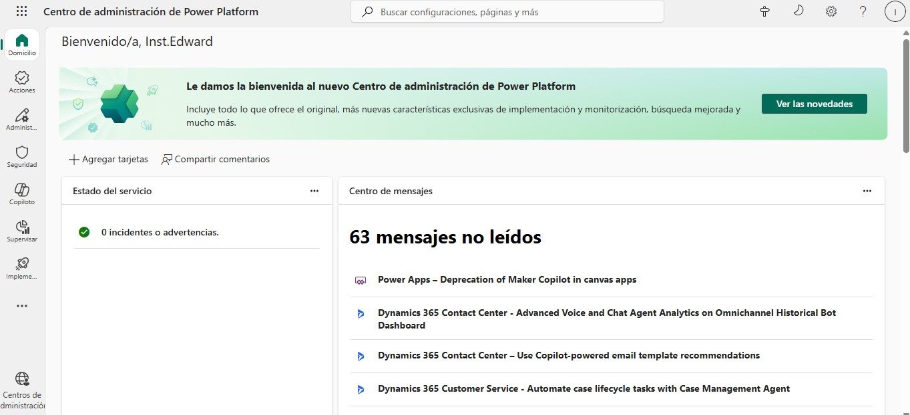

## Duración aproximada
- 60 minutos.

## Tabla de ayuda
Acceso a tu cuenta Microsoft 365.

## Instrucciones 

### Tarea 1. Descargar y preparar archivos de instalación.
**Paso 1.** Descarga el Starter Kit del Centro de excelencia de https://aka.ms/coestarterkitdownload

**Paso 2.** Descomprime el archivo zip.

**Paso 3.** Descarga el Creator Kit Core de:
https://github.com/microsoft/powercat-creator-kit/releases/download/CreatorKit-March2025/CreatorKitCore_1_0_20250310_1_managed.zip

### Tarea 2. Crear entorno independiente en el centro de administración de Power Platform
**Paso 1.** Ingresa a https://admin.powerplatform.microsoft.com/manage/environments

**Paso 2.** Selecciona `Nuevo` y sigue las indicaciones resaltadas en rojo de las imágenes.

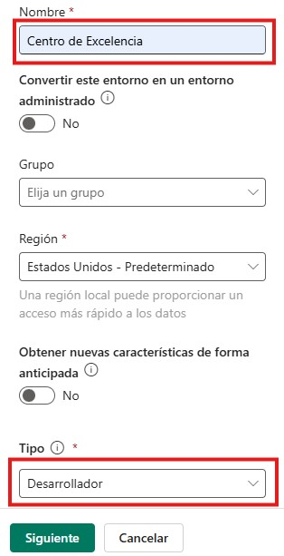

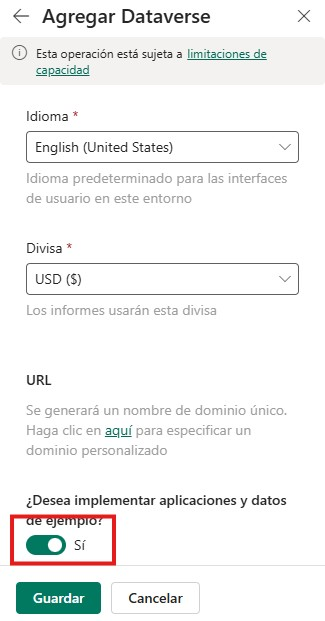

**Paso 3.** Una vez creado el entorno, realiza las siguientes configuraciones asegurando que queden guardadas:

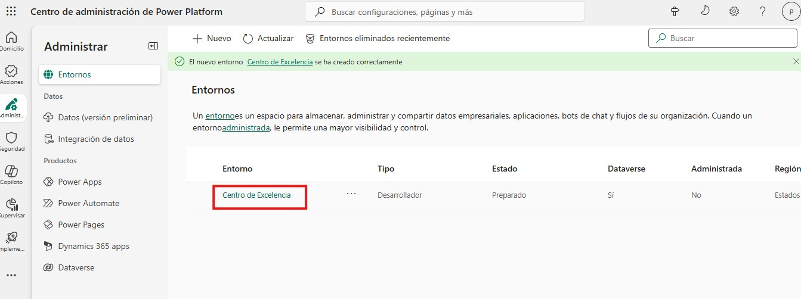

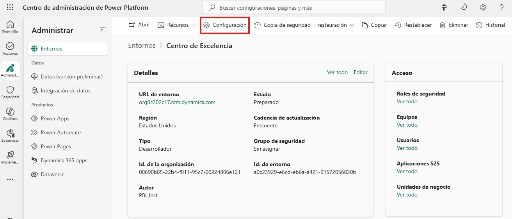

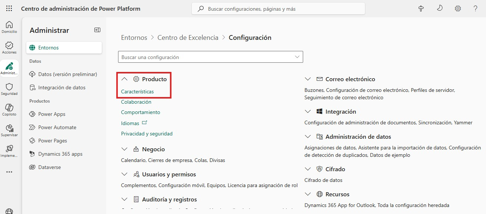

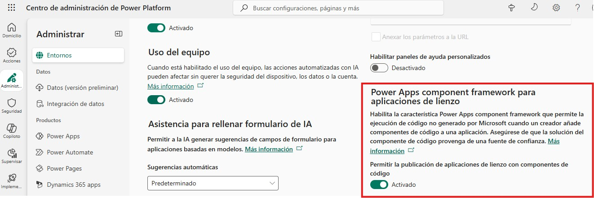

### Tarea 3. Instalar kit de creación
**Paso 1.** Ingresa a https://make.powerapps.com/

**Paso 2.** Selecciona el entorno creado en la tarea anterior.

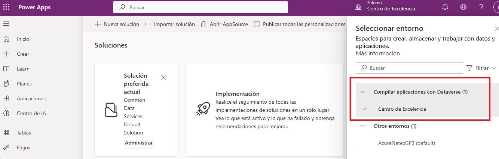

**Paso 3.** Importa el Creator Kit siguiendo estos pasos:

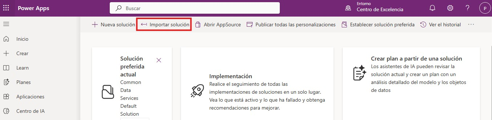

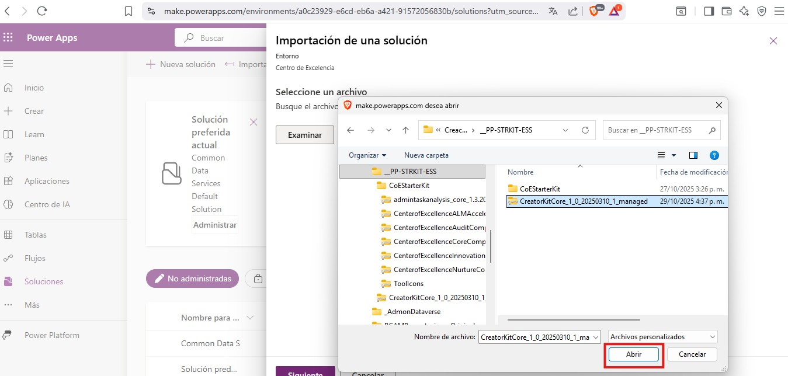

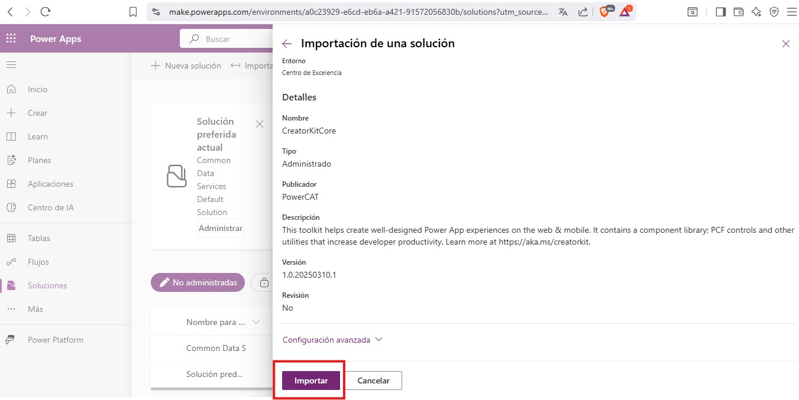

### Tarea 4. Instalar CoreComponents de Starter Kit 
**Paso 1.** Continua en el entorno ya creado e importa el archivo `CenterofExcellenceCoreComponents_4.50.6_managed` siguiendo estos pasos:

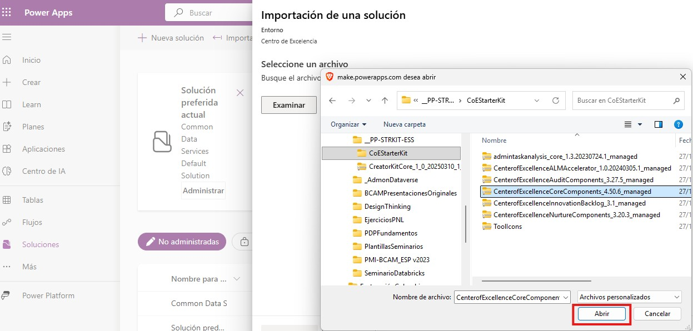

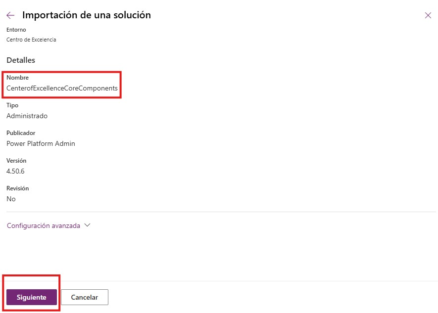

**Paso 2.** Al momento de verificar las 21 conexiones, si tienes todos los prerequisitos de licencia, debe aparecer el check en verde. Sin embargo, en algunas ocasiones, la conexion CoE Core - HTTP With Azure AD debe configurarse, si es así pasa a la tarea 5.

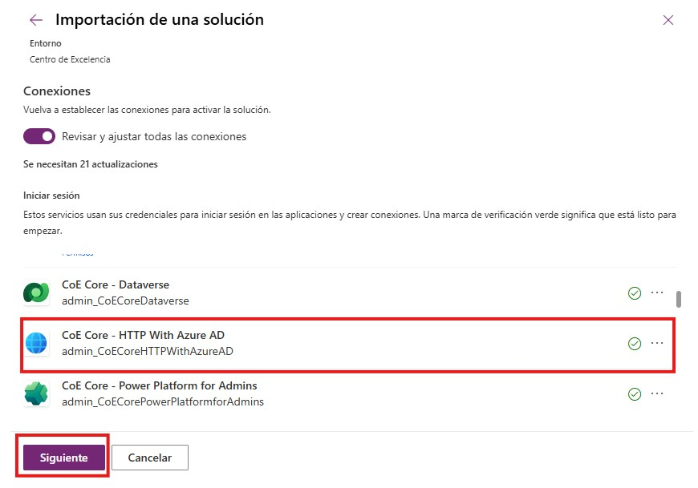

**Paso 3.** Una vez validadas las conexiones, se listan las variables de entorno, las cuales se configurarán más adelante de acuerdo con los objetivos del CoE.

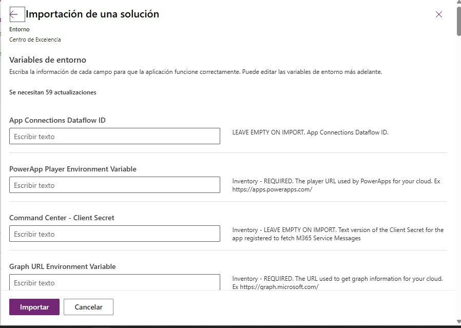

**Paso 4.** Al finalizar el flujo de importación, debes esperar un tiempo considerable dependiendo el tipo de licencia que uses para que la importación se realice.

### Tarea 5 (opcional). Crear la Conexión HTTP with Microsoft Entra ID (preautorizado)
**Paso 1.** Ingresa a https://make.powerautomate.com

**Paso 2.** Ve a `Conexiones` y selecciona `+ Nueva conexión`.

**Paso 3.** Busca el conector en el buscador de la parte superior derecha digitando HTTP y selecciona HTTP with Microsoft Entra ID (preautorizado).

**Paso 4.** Configura la conexión con esta información.
| Campo | Valor a escribir |
| --- | --- |
| Authentication type | Iniciar sesión con credenciales de Microsoft Entra ID |
| Dirección URL | https://graph.microsoft.com |
| URL de recurso | https://graph.microsoft.com |

Se abrirá una ventana emergente de inicio de sesión y luego de autenticarse se cerrará automáticamente.

**Paso 5.** La conexión se creará y desplegará este mensaje.

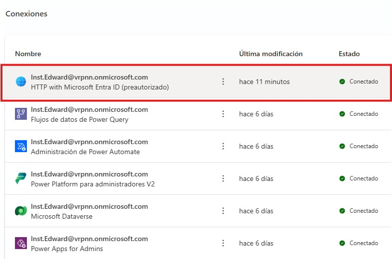

**Paso 6.** Retoma la Tarea 4 desde el punto en que quedaste.

### Resultado esperado

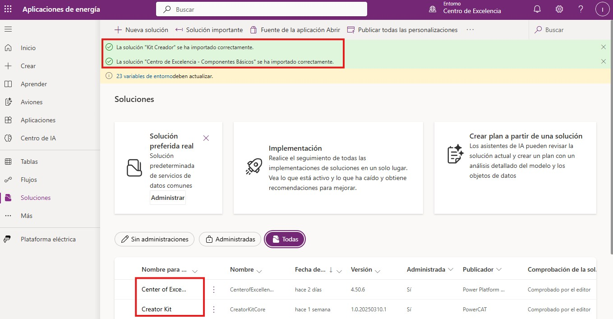
