# Configurar y validar que los flujos funcionan

## Objetivo de la práctica:
Al finalizar la práctica, serás capaz de:
- Configurar correctamente los componentes del CoE Starter Kit en Power Platform y validar que la instalación esté completa, funcional y alineada con las dependencias requeridas (entornos, conexiones, flujos y aplicaciones).

## Objetivo Visual 
Completar la instalación y validación básica del CoE Starter Kit, dejando configurada una base funcional sobre la cual el usuario podrá ampliar, personalizar y optimizar las funcionalidades según las necesidades de su organización, como se muestra en la imagen:

## Duración aproximada:
- 60 minutos.

## Tabla de ayuda:
Acceso a tu cuenta Microsoft 365.

## Instrucciones 
<!-- Proporciona pasos detallados sobre cómo configurar y administrar sistemas, implementar soluciones de software, realizar pruebas de seguridad, o cualquier otro escenario práctico relevante para el campo de la tecnología de la información -->
### Tarea 1. Ingresar al Center of Excellence - Core Components para verificar las aplicaciones, flujos y demás recursos instalados
Paso 1. Ingresa al Center of Excellence - Core Components.

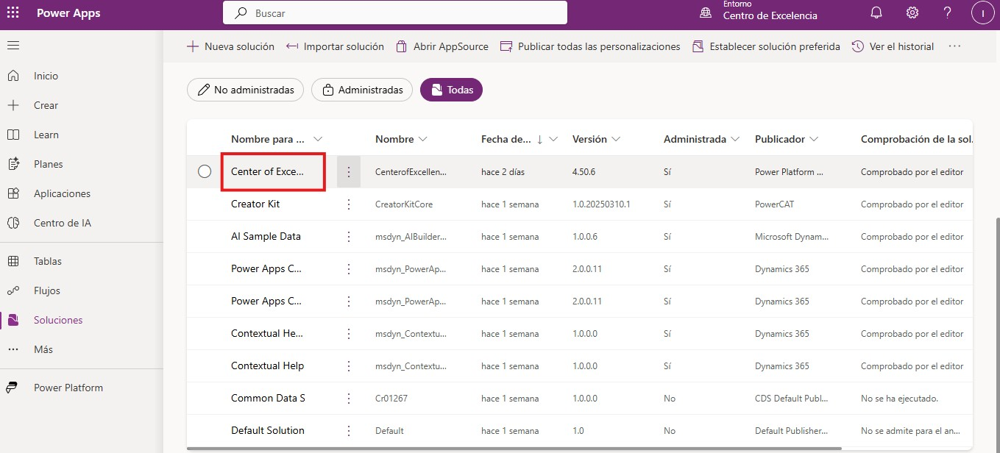

Paso 2. Navega por los diferentes recursos, como aplicaciones o dashboards, para conocer las diferencias capacidades que ofrece el CoE.

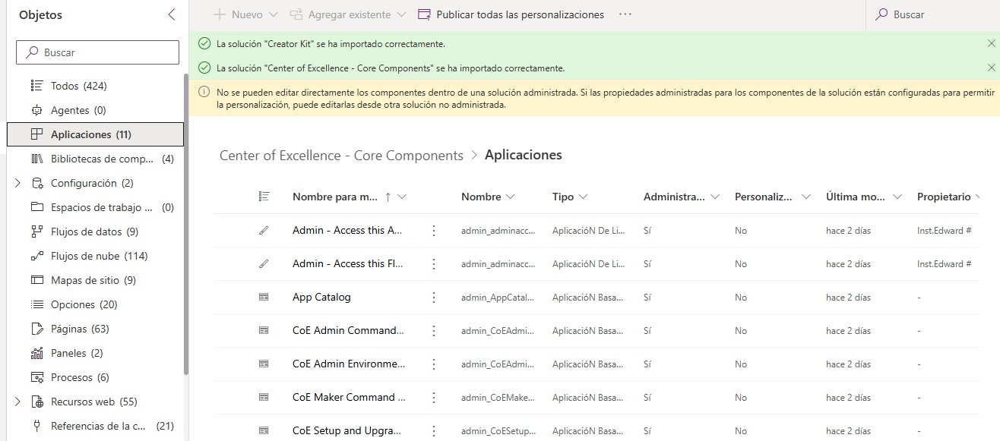

Paso 3. Navega por flujos de nube para identificar cual activar en algún momento determinado.

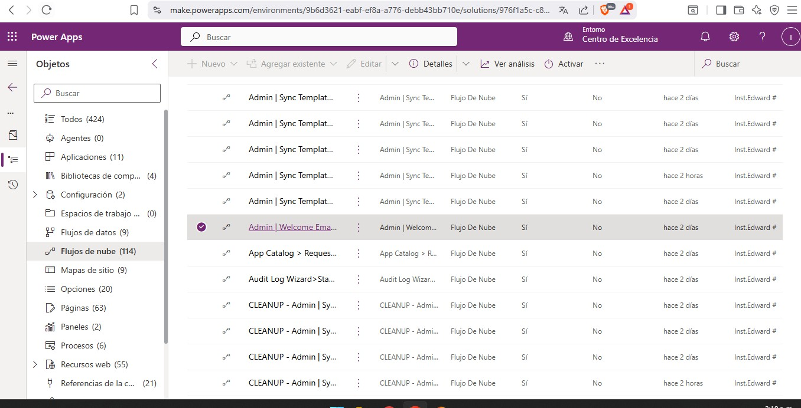

### Tarea 2. Configurar y actualizar el CoE, siguiendo y sobre todo, entendiendo la importancia de cada paso
Paso 1. Busca la aplicación según la imagen.

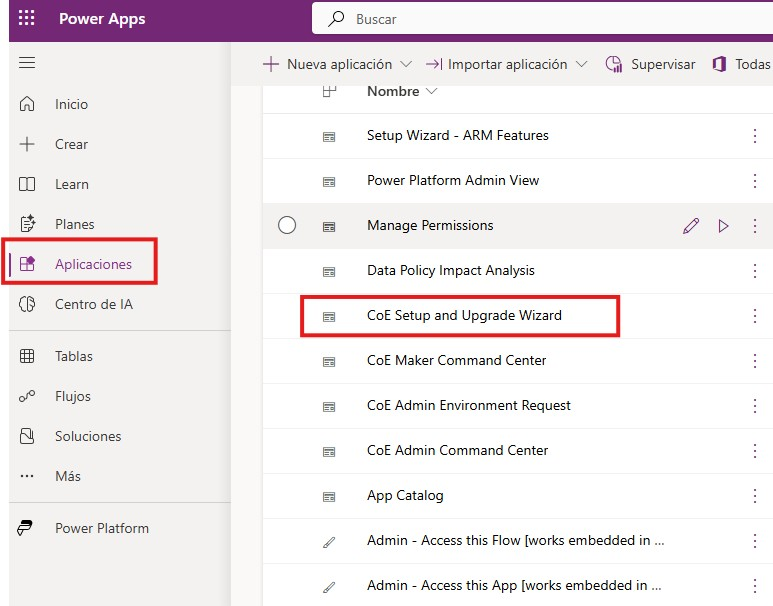

Paso 2. Revisa y confirma las conexiones.

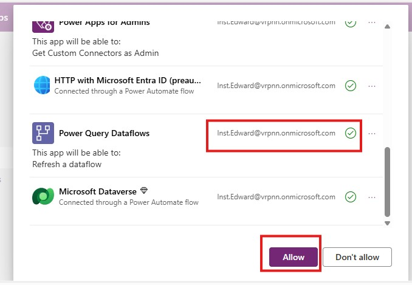

Paso 3. Luego confirma los prerequisitos dependiendo el nivel de autorización que desees.

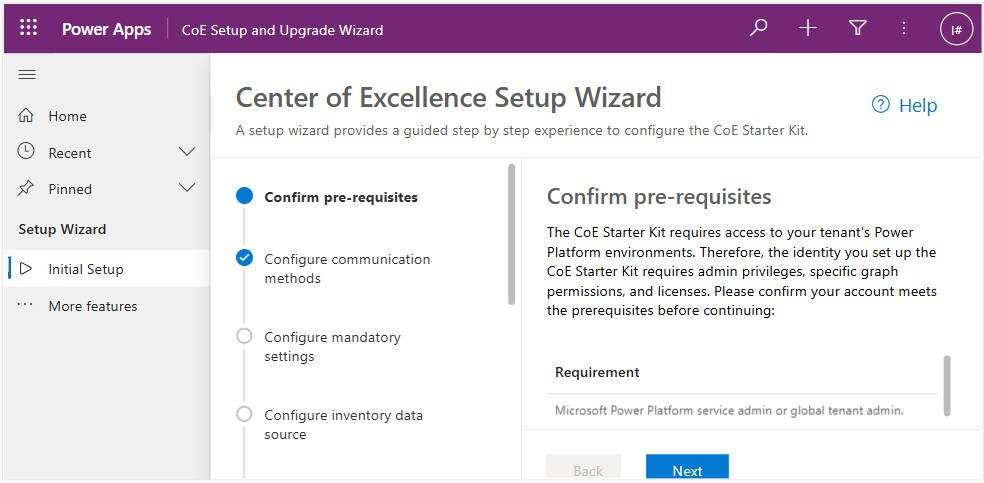

Paso 4. Configura los métodos de autenticación dependiendo del rol.

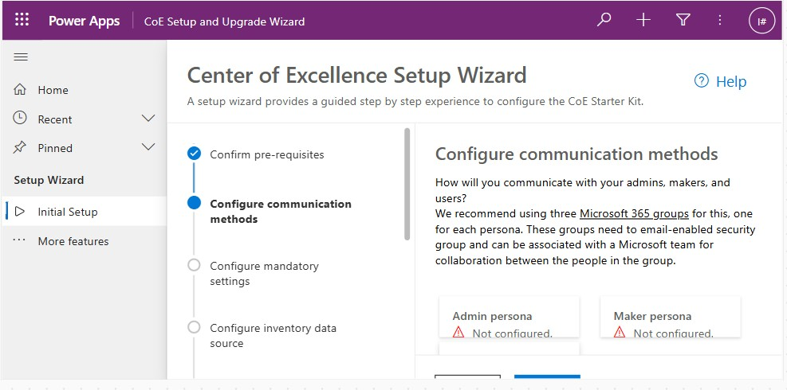

Así mismo puedes configurar y vincular a grupos existentes o crear grupos nuevos.

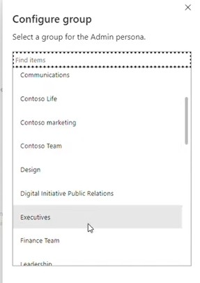

Paso 5. Configura las configuraciones obligatorios, que generalmente ya vienen por defecto.

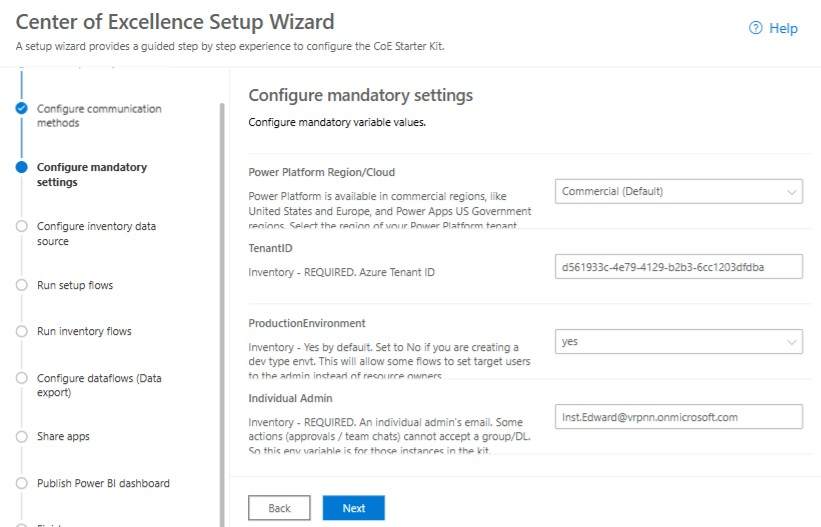

Paso 6. Configura la fuente de datos del inventario.

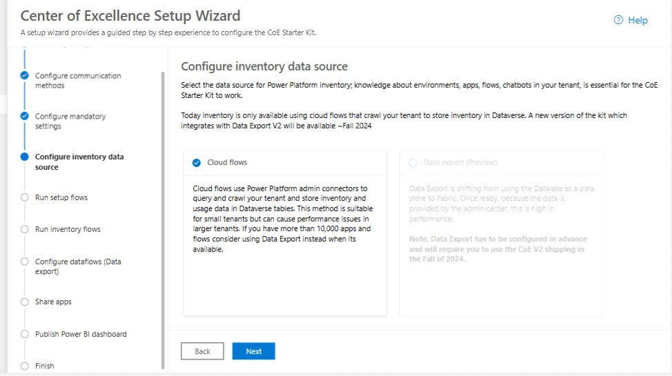

Paso 7. Ejecuta los flujos principales y refresca para ver el avance, ya que este proceso puedo tardar algunos minutos.

Paso 8. Una vez finalizado el paso anterior ejecuta los flujos de inventario para que recopilen toda la información que tenemos dentro de nuestro inquilino, esa recopilación dependera del tipo de licencia que tengas, permitiendo la activación o no, de los flujos seleccionados

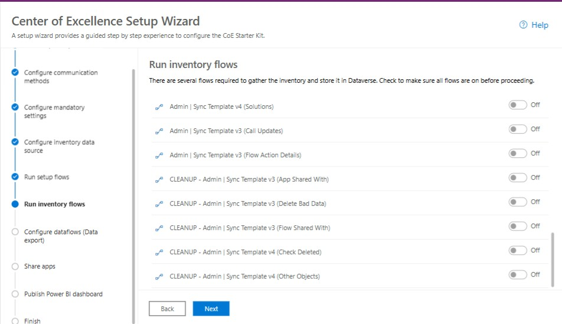

Paso 9. Comparte las aplicaciones con tus compañeros del equipo de administración

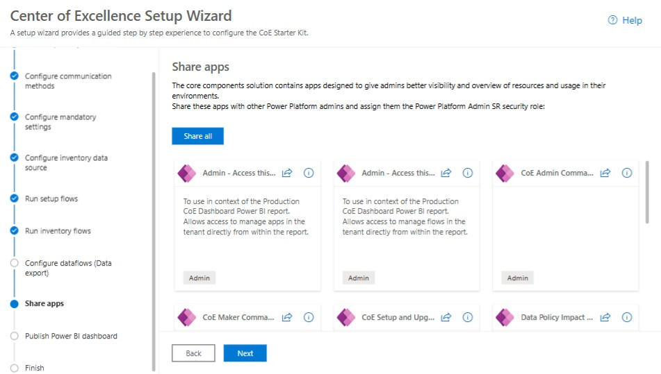

Paso 10. Conoce los paneles disponibles en Power Bi.

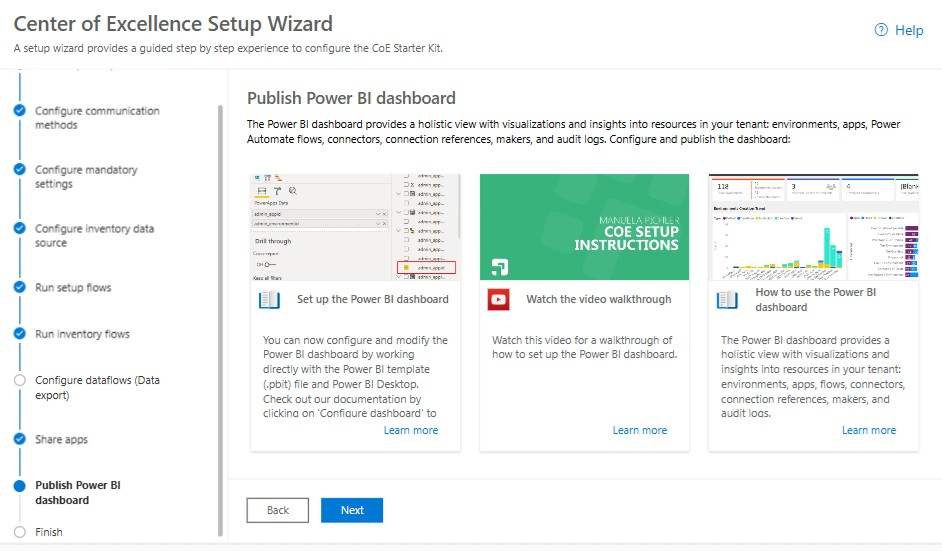

### Resultado esperado

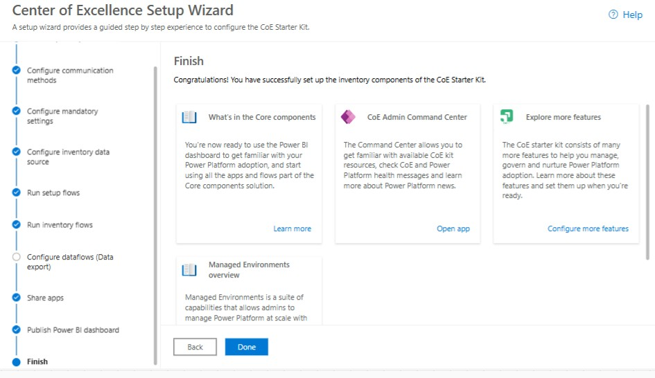

