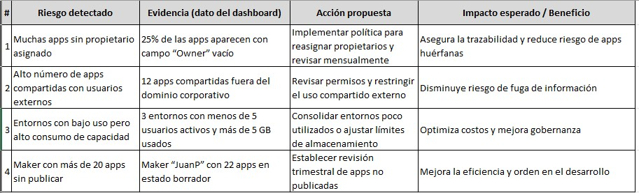
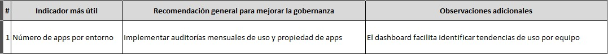

# Analizar un dashboard de gobernanza, detectar riesgos y proponer acciones

## Objetivo de la práctica:
Al finalizar la práctica, serás capaz de:
- Analizar la información presentada en un dashboard de gobernanza de Power Platform para identificar riesgos asociados al uso de aplicaciones y entornos, y proponer acciones de mejora que fortalezcan la administración y el cumplimiento de las políticas de la organización.

## Objetivo Visual 
Acceder al CoE Starter Kit Dashboard

## Duración aproximada:
- 60 minutos.

## Tabla de ayuda:
- Acceso a tu cuenta Microsoft 365.
- Acceso a Power BI Desktop.

## Instrucciones 
<!-- Proporciona pasos detallados sobre cómo configurar y administrar sistemas, implementar soluciones de software, realizar pruebas de seguridad, o cualquier otro escenario práctico relevante para el campo de la tecnología de la información -->

### Tarea 1. Intentar activar los flujos del CoE Core
Paso 1. Abre el entorno correcto
- Entra a make.powerapps.com
- Arriba a la derecha selecciona el entorno donde instalaste el Core Components.

Paso 2. Ve a la solución del CoE Core
- Navega a Soluciones → Center of Excellence – Core Components.

Paso 3. Filtra los flujos más relevantes para la demo, para ello busca y muestra estos (mínimos para ilustrar el propósito):
- Admin | Sync Template v4 (Apps)
- Admin | Sync Template v4 (Flows)
- Admin | Sync Template v4 (Environments) *O similar como: CLEANUP HELPER - Environment Capacity
- Admin | Sync Template v4 (Maker) *Opcional

Paso 4. Intenta activarlos, abriendo cada flujo → clic en Activar.
- Si da error (por el mensaje de InvalidPaginationPolicy o Managed properties), no es por falta de permisos del usuario ni por la licencia de Microsoft 365. Es una restricción técnica: el CoE Starter Kit viene instalado como una Managed Solution, lo que significa que sus componentes están protegidos contra edición directa. Esto lo hace Microsoft para evitar que se dañen los flujos base del kit. Por eso no podemos guardar ni activar algunos flujo.
- Si quisiéramos modificar o activar estos flujos, tendríamos que instalar una versión Unmanaged del CoE Core. Esa versión sí permite editar, guardar y activar sin restricciones, porque no está protegida. Esto debido a que Microsoft bloqueó casi todas las opciones de edición directa y exportación en las soluciones managed del CoE Starter Kit, justamente para proteger su estructura interna.
- En este curso proporcionado por Microsoft usamos un entorno de práctica educativo, por eso algunos flujos del CoE aparecen bloqueados.
Pero cuando una organización implementa el CoE Starter Kit en su propio entorno empresarial, sí puede configurarlo completamente porque cumple tres condiciones que aquí no tenemos:

1️⃣ Tiene permisos de administrador global o de Power Platform Admin.

2️⃣ Dispone de los conectores necesarios (por ejemplo, Power Platform for Admins).

3️⃣ En algunos casos, puede solicitar directamente al equipo de TI una versión Unmanaged del CoE si desean personalizar los flujos.

### Tarea 2. Importar desde Power BI. La lógica detrás de esos flujos es la que recopila datos de Power Platform y los guarda en Dataverse, para luego verse en Power BI. 

Paso 1. Obtiene el Environment URL
- Entra a https://admin.powerplatform.microsoft.com/
- Selecciona la opción de "Administrar" en el menu de la izquierda
- En el centro, selecciona el entorno que quieres usar.
- Da click en la URL de entorno
- Se abre otra ventana en donde debes copiar el link (Usa todo hasta el .com sin /main.aspx), algo como: https://orgXXXX.crm.dynamics.com/

Paso 2. Abre Power BI Desktop
- Abre el archivo Production_CoEDashboard_MMMYY.pbit que esta en la carpeta CoEStarterKit
- Ingresa el link del paso 1 y deja el Tenant en Commercial o el tipo de licencia que tengas.
  

- Espera la carga de datos

  

Paso 3. Valida los datos
- Si los flujos del CoE ya generaron datos en Dataverse, Power BI los traerá y mostrará las tablas (Apps, Environments, Makers, etc.).
- Si no hay datos (porque los flujos aún no se ejecutan), Power BI mostrará tablas vacías, en ese caso pasaremos a la Tarea 3 Alternativa.

### Tarea 3 Alternativa. Consultar un Power BI Demo.

Paso 1. Descarga el archivo con datos simulados llamado DemoMicrosoft.pbix del siguiente link:
- https://1drv.ms/f/c/ae8d4f629773f03e/ElDMZl06ujRCt-fMWK-7rcABDPUV2Yjof5i3a_TqfZzhjg?e=aY3si6

Paso 2. Abre el archivo DemoMicrosoft.pbix que es el insumo para la siguiente tarea.

### Tarea 4. Analizar un dashboard de gobernanza, detectar riesgos y proponer acciones.
- Conexto: Tu organización ha implementado el Centro de Excelencia (CoE) para Power Platform y ha configurado un dashboard de gobernanza en Power BI. El objetivo del equipo es monitorear el uso de las aplicaciones, los entornos y los creadores (makers), identificando posibles riesgos que puedan afectar la seguridad, la capacidad o el cumplimiento de políticas.

Paso 1. Usa el insumo generado en la tarea 2 o el alternativo de la tarea 3.

Paso 2. Explora las secciones del dashboard, especialmente:
- Overview
- Apps
- Makers
- Environments

Paso 3. Descarga el archivo de registro llamado AnálisisCoEMicrosoft.xlsx del siguiente link para realizar el registro de la información:
- https://1drv.ms/f/c/ae8d4f629773f03e/ElDMZl06ujRCt-fMWK-7rcABDPUV2Yjof5i3a_TqfZzhjg?e=aY3si6

Paso 4. Identifica tres riesgos potenciales observados en los datos y registrarlos en el Excel en la hoja "Riesgos y acciones". Por ejemplo:
- Apps sin propietario activo
- Usuarios con demasiadas apps compartidas externamente
- Entornos con poca capacidad disponible

Paso 5. Sugiere una acción o medida correctiva para cada riesgo identificado y registrarlos en el Excel en la hoja "Riesgos y acciones". Por ejemplo:
- Riesgo: Entorno con uso de almacenamiento al 95%.
- Acción: Solicitar limpieza de datos o ampliar capacidad del entorno.

Paso 6. Identifica los indicadores más útiles y registralos en la hoja "Conclusiones" del Excel

### Resultado esperado
Riesgos y acciones

Conclusiones

