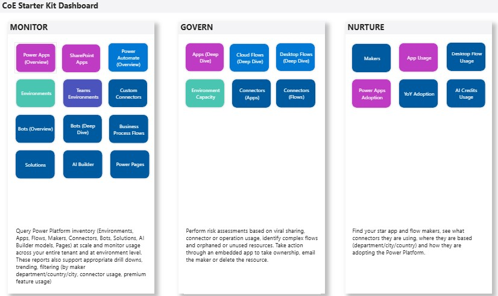
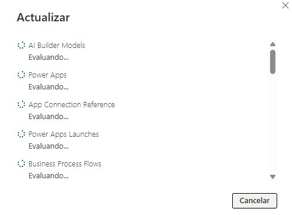

# Analizar un dashboard de gobernanza, detectar riesgos y proponer acciones

## Objetivo de la práctica:
Al finalizar la práctica, serás capaz de:
- Objetivo1
- Objetivo2
- Objetivo3

## Objetivo Visual 
Acceder al CoE Starter Kit Dashboard

## Duración aproximada:
- xx minutos.

## Tabla de ayuda:
Agregar una tabla con la información que pueda requerir el participante durante el laboratorio, como versión de software, IPs de servers, usuarios y credenciales de acceso.
| Contraseña | Correo | Código |
| --- | --- | ---|
| Netec2024 | edgardo@netec.com | 123abc |

## Instrucciones 
<!-- Proporciona pasos detallados sobre cómo configurar y administrar sistemas, implementar soluciones de software, realizar pruebas de seguridad, o cualquier otro escenario práctico relevante para el campo de la tecnología de la información -->

### Tarea 1. Intentar activar los flujos del CoE Core
Paso 1. Abrir el entorno correcto
- Entra a make.powerapps.com
- Arriba a la derecha selecciona el entorno donde instalaste el Core Components.

Paso 2. Ir a la solución del CoE Core
- Navega a Soluciones → Center of Excellence – Core Components.

Paso 3. Filtrar los flujos más relevantes para la demo, para ello busca y muestra estos (mínimos para ilustrar el propósito):
- Admin | Sync Template v4 (Apps)
- Admin | Sync Template v4 (Flows)
- Admin | Sync Template v4 (Environments) *O similar como: CLEANUP HELPER - Environment Capacity
- Admin | Sync Template v4 (Maker) *Opcional

Paso 4. Intentar activarlos, abriendo cada flujo → clic en Activar.
- Si da error (por el mensaje de InvalidPaginationPolicy o Managed properties), no es por falta de permisos del usuario ni por la licencia de Microsoft 365. Es una restricción técnica: el CoE Starter Kit viene instalado como una Managed Solution, lo que significa que sus componentes están protegidos contra edición directa. Esto lo hace Microsoft para evitar que se dañen los flujos base del kit. Por eso no podemos guardar ni activar algunos flujo.
- Si quisiéramos modificar o activar estos flujos, tendríamos que instalar una versión Unmanaged del CoE Core. Esa versión sí permite editar, guardar y activar sin restricciones, porque no está protegida. Esto debido a que Microsoft bloqueó casi todas las opciones de edición directa y exportación en las soluciones managed del CoE Starter Kit, justamente para proteger su estructura interna.
- En este curso proporcionado por Microsoft usamos un entorno de práctica educativo, por eso algunos flujos del CoE aparecen bloqueados.
Pero cuando una organización implementa el CoE Starter Kit en su propio entorno empresarial, sí puede configurarlo completamente porque cumple tres condiciones que aquí no tenemos:

1️⃣ Tiene permisos de administrador global o de Power Platform Admin.

2️⃣ Dispone de los conectores necesarios (por ejemplo, Power Platform for Admins).

3️⃣ En algunos casos, puede solicitar directamente al equipo de TI una versión Unmanaged del CoE si desean personalizar los flujos.

### Tarea 2. Importar desde Power BI. La lógica detrás de esos flujos es la que recopila datos de Power Platform y los guarda en Dataverse, para luego verse en Power BI. 

Paso 1. Obtener el Environment URL
- Entra a https://admin.powerplatform.microsoft.com/
- Selecciona la opción de "Administrar" en el menu de la izquierda
- En el centro, selecciona el entorno que quieres usar.
- Da click en la URL de entorno
- Se abre otra ventana en donde debes copiar el link (Usa todo hasta el .com sin /main.aspx), algo como: https://orgXXXX.crm.dynamics.com/

Paso 2. Abrir Power BI Desktop
- Abre el archivo Production_CoEDashboard_MMMYY.pbit que esta en la carpeta CoEStarterKit
- Ingresa el link del paso 1 y deja el Tenant en Commercial o el tipo de licencia que tengas.

- Espera la carga de datos

Paso 3. Validar datos
- Si los flujos del CoE ya generaron datos en Dataverse, Power BI los traerá y mostrará las tablas (Apps, Environments, Makers, etc.).
- Si no hay datos (porque los flujos aún no se ejecutan), Power BI mostrará tablas vacías, en ese caso pasaremos a la Tarea 3 Opcional.

### Tarea 3 Opcional. Importar desde Power BI desde CSV en modo demo

Paso 1. Obtener el Environment URL
- Entra a https://admin.powerplatform.microsoft.com/
- Selecciona la opción de "Administrar" en el menu de la izquierda
- En el centro, selecciona el entorno que quieres usar.
- Da click en la URL de entorno
- Se abre otra ventana en donde debes copiar el link (Usa todo hasta el .com sin /main.aspx), algo como: https://orgXXXX.crm.dynamics.com/

Paso 2. Abrir Power BI Desktop
- Abre el archivo Production_CoEDashboard_MMMYY.pbit que esta en la carpeta CoEStarterKit
- Ingresa el link del paso 1 y deja el Tenant en Commercial o el tipo de licencia que tengas.

- Espera la carga de datos

Paso 3. Validar datos
- Si los flujos del CoE ya generaron datos en Dataverse, Power BI los traerá y mostrará las tablas (Apps, Environments, Makers, etc.).
- Si no hay datos (porque los flujos aún no se ejecutan), Power BI mostrará tablas vacías, en ese caso pasaremos a la Tarea 3 Opcional.
- 
### Resultado esperado
En esta sección se debe mostrar el resultado esperado de nuestro laboratorio

