# Crear un flujo de trabajo para registrar y priorizar ideas en el backlog

## Objetivo de la práctica:
Al finalizar la práctica, serás capaz de:
- Implementar y explorar el módulo Innovation Backlog del Center of Excellence (CoE) Starter Kit para registrar, priorizar y administrar ideas de innovación mediante una aplicación en Power Apps y un flujo de trabajo interno en Dataverse que permite gestionar el estado y seguimiento de cada propuesta.

## Objetivo Visual 
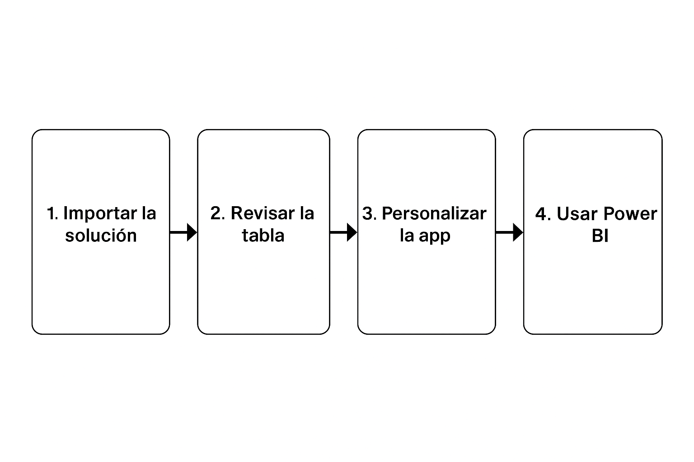

## Duración aproximada:
- 60 minutos.

## Tabla de ayuda:
- Acceso a tu cuenta Microsoft 365.
- Acceso a Power BI Desktop.

## Instrucciones 
<!-- Proporciona pasos detallados sobre cómo configurar y administrar sistemas, implementar soluciones de software, realizar pruebas de seguridad, o cualquier otro escenario práctico relevante para el campo de la tecnología de la información -->
### Tarea 1. Importación de la solución.
Paso 1. Ingresa a https://make.powerapps.com y selecciona el entorno CoE

Paso 2. Selecciona Soluciones → Importar solución y carga el archivo CenterofExcellenceInnovationBacklog

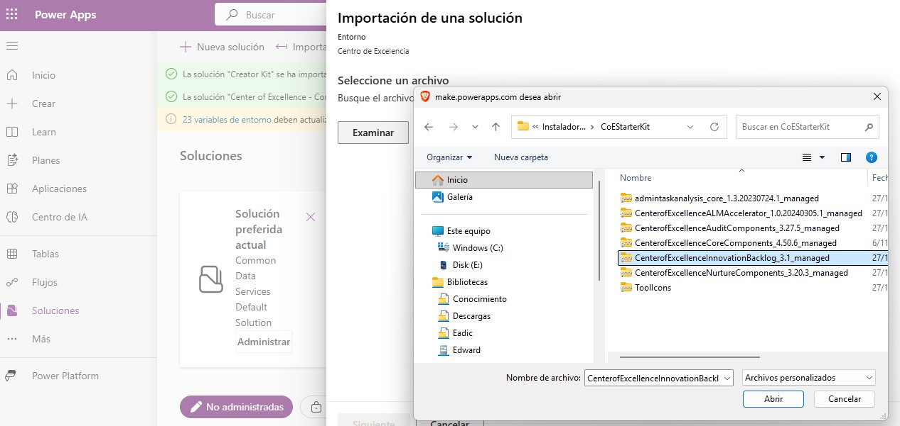

Paso 3. Espera el proceso de validación y haz clic en Importar. Este proceso puede tardar varios minutos según el entorno. No cierres la página durante la importación.

Paso 4. Una vez finalizado, revisa que el estado de la solución sea Importado correctamente.

Paso 5. Comprueba que la aplicación Innovation Backlog (edición) aparezca en la lista de apps.

### Tarea 2. Revisar la tabla Innovation Backlog Idea
Paso 1. En el panel izquierdo, selecciona Tablas, luego Todos, busca por "innova" y abre la tabla Innovation Backlog Idea. 

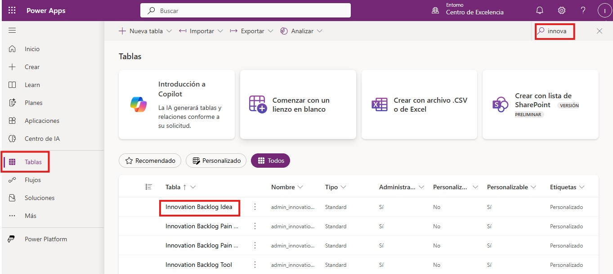

Paso 2. Revisa los campos principales que contiene, como:
- name (Nombre o título de la idea)
- displayname (Autor o responsable)
- ideastatus (Estado actual de la idea)
- moneysavingspotential (Ahorro monetario potencial)
- timesavingspotential (Ahorro de tiempo potencial)
- numberworkitems (Número de tareas o entregables relacionados)

### Tarea 3. Usar y personalizar el App
Paso 1. En Power Apps → Aplicaciones, abre Innovation Backlog.

Paso 2. Ejecuta la aplicación y crea tres ideas nuevas, completando los campos.

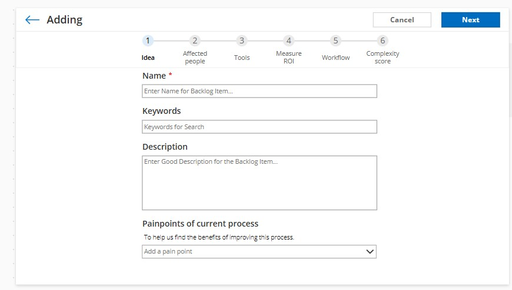

Paso 3. Comprueba que se guardan correctamente en Dataverse.

Paso 4. Regresa a la aplicación, ve a Archivo → Guardar como y crea una copia llamada “Registro de Ideas – Tu nombre”

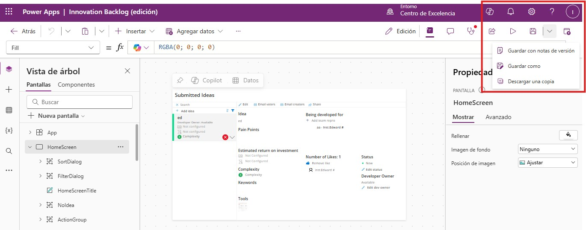

Paso 5. Abre tu copia y realiza estas personalizaciones sencillas:
- Cambia el título por “Registro de Ideas de Innovación”.
- Ajusta tema o colores en Archivo → Configuración → Tema.

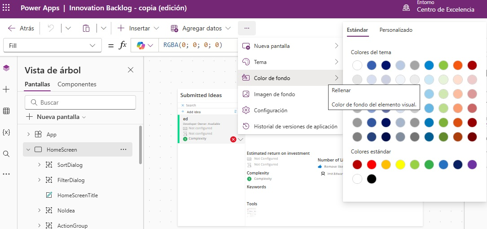

- Guarda y publica la aplicación.
- Crea una nueva idea desde tu versión personalizada y verifica su correcto guardado en Dataverse.

### Tarea 4. Crear vista de revisión
Paso 1. Ve a Tablas → Innovation Backlog Idea, abre la pestaña Vistas.

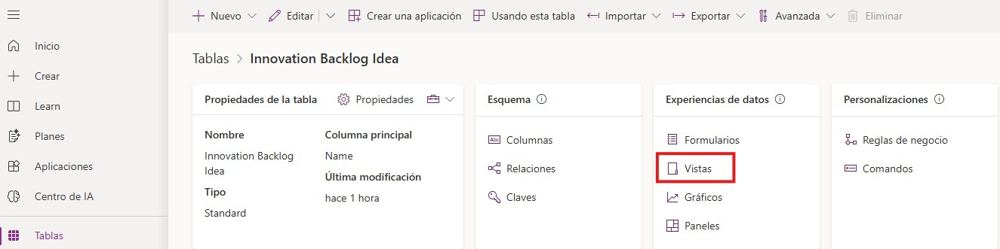

Paso 2. Selecciona + Agregar vista.

Paso 3. Nombra la vista Ideas pendientes.

Paso 4. Define el filtro ideastatus = “Idea Submitted”

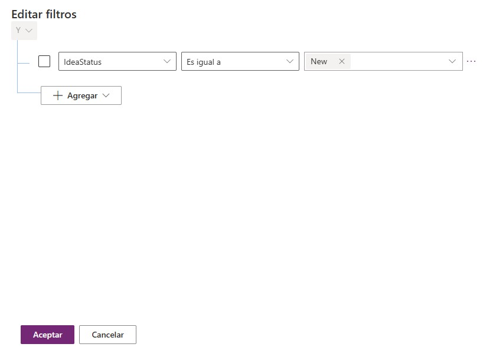

Paso 5. Agrega columnas clave para mostrar:
- name (Nombre de la idea)
- displayname (Autor)
- moneysavingspotential (Ahorro monetario potencial)
- timesavingspotential (Ahorro de tiempo potencial)
- ideastatus (Estado)
- createdon (Fecha de creación)

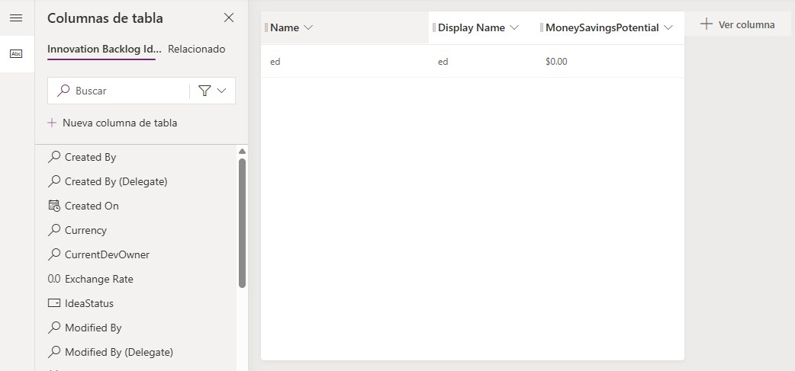

- Guarda y publica la vista.

- En la pestaña Datos, selecciona la vista Ideas pendientes

### Tarea 5. Publicar en Power BI
Paso 1. Abre Power BI Desktop y en la pantalla inicial, selecciona Obtener datos → Dataverse.

Paso 2. Conéctate usando la misma cuenta de tu entorno del CoE.

Paso 3. Busca la tabla Innovation Backlog Idea y haz clic en Cargar.

Paso 4. Inserta un gráfico de barras agrupadas y configura los ejes:
- Eje X: moneysavingspotential (Ahorro monetario potencial)
- Eje Y: name (Nombre de la idea)
- Opcional: Cambia el eje X por timesavingspotential para analizar el ahorro de tiempo.
- Este gráfico permite ver rápidamente que ideas tienen mayor impacto económico o en tiempo.

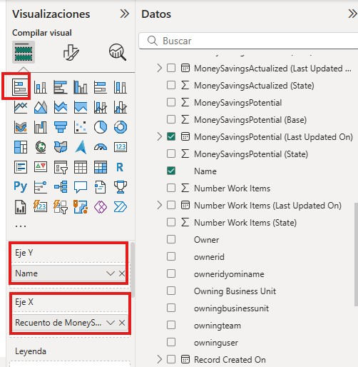

### Resultado esperado
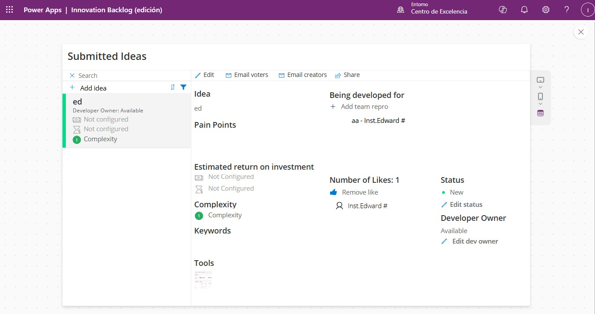
